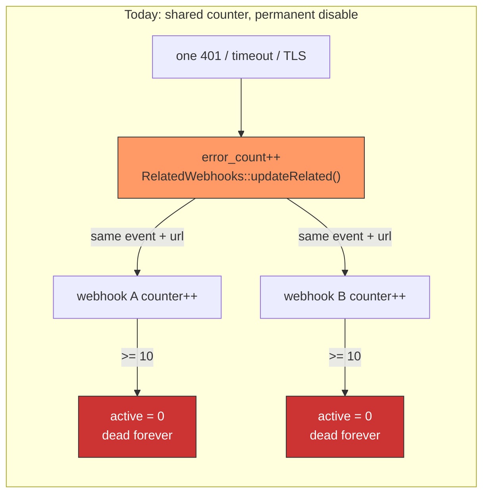
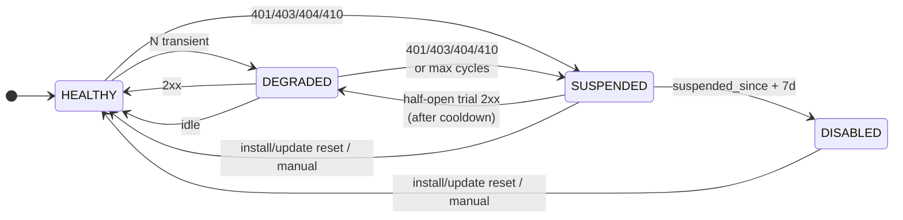
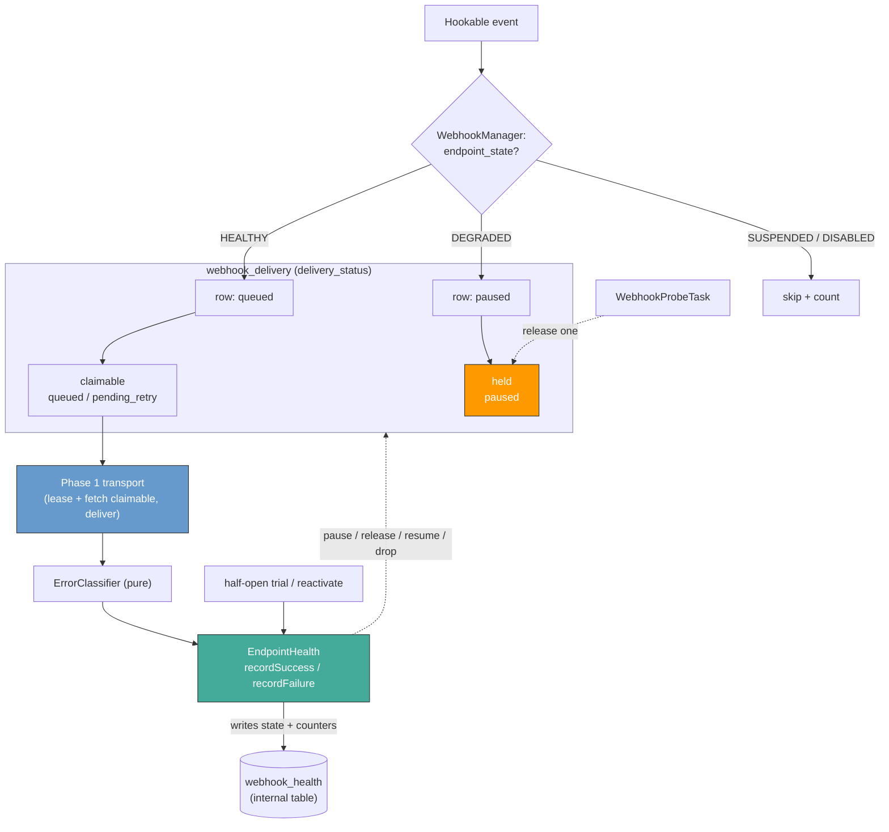
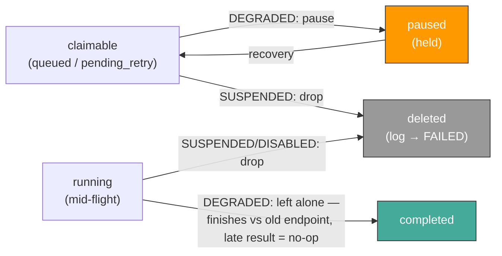
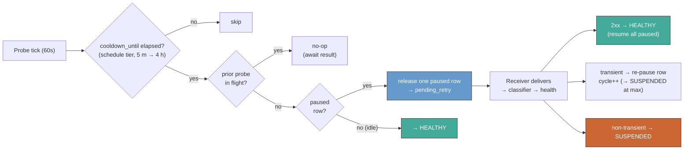
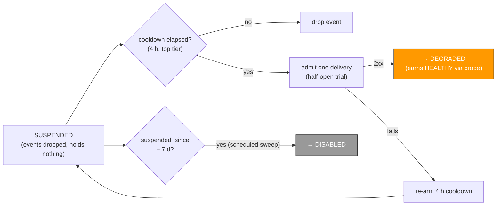

# Webhook endpoint health remodel

> Per-webhook health, automatic recovery, and bounded suspension — replacing the shared `error_count` and permanent-disable mechanism with a four-state circuit breaker behind the Phase 1 `WEBHOOKS_REWORK` flag. The health model gates delivery **without entangling the Phase 1 transport**.

Tracking: [shopware/shopware#16565](https://github.com/shopware/shopware/issues/16565) (follow-up to [#16560](https://github.com/shopware/shopware/issues/16560)).
Foundation: [`adr/2026-04-14-webhook-outbox-transport.md`](2026-04-14-webhook-outbox-transport.md).

---

## Why

Phase 1 owns the transport, but failure handling is still the legacy stopgap: `RetryWebhookMessageFailedSubscriber` increments `webhook.error_count`; `RelatedWebhooks::updateRelated()` propagates it to every webhook sharing `event_name + url`; and at `error_count >= 10` the webhook flips `active = 0` and needs manual reactivation.

The outbox alone can't fix three failure modes:

| Problem | Impact |
|:---|:---|
| **Cross-webhook blast radius** — shared `error_count` propagates across event+URL siblings | One broken endpoint disables unrelated webhooks; a success on one resets siblings |
| **No error semantics** — one counter, every failure mode | A `401` is indistinguishable from a `503`; auth and infra failures escalate at the same rate |
| **No automatic recovery** — `active = 0` is a kill switch | A 10-minute outage requires manual reactivation hours later |

---

## Decision

Per-webhook **four-state health**, pure **error classifier**, **automatic recovery** (cooldown probe for DEGRADED; SUSPENDED self-heals via a half-open trial on natural traffic once a backoff cooldown elapses; plus an app-install/update clean-slate reset), bounded **SUSPENDED → DISABLED** escalation at a configurable day count (default 7). Behind the existing `WEBHOOKS_REWORK` flag. Flag-off keeps the existing legacy behaviour unchanged.

| State | Dispatch | Delivery | Recovery |
|:---|:---|:---|:---|
| **HEALTHY** | yes | yes | — |
| **DEGRADED** | yes — rows held (`paused`) | paused; one cooldown-gated probe at a time | probe `2xx`, or idle (no `paused` row, nothing in flight) → HEALTHY |
| **SUSPENDED** | **no — events skipped** | no — backlog dropped (rows deleted, `webhook_event_log` → FAILED) | half-open trial on natural traffic once the cooldown lease elapses → **DEGRADED** on `2xx` (then earns HEALTHY via the probe); app install/update reset → HEALTHY; `suspended_since + 7 d` → DISABLED |
| **DISABLED** | no | no | app install/update reset, or manual |

The model is per-webhook. An app with five subscriptions has five independent health states; a 401 on `/customers` does not pause `/orders`.

### Core building blocks

1. **`EndpointHealth`** — owns `webhook_health` and every state transition.
2. **`ErrorClassifier`** — a pure `(status, exception) → enum` mapping; stateful logic stays in the service.
3. **Dispatch gate** — `WebhookManager` classifies each event via `gateFor` → deliver / hold / skip. The transport then persists a claimable row (HEALTHY), a held (`paused`) row (DEGRADED), or nothing (SUSPENDED/DISABLED — the event is counted). The decision is health-aware; insertion stays in the transport, which reads the resulting status, not health.
4. **`paused` delivery status** — the held state the transport ignores; health gates delivery by pausing and releasing rows, leaving the Phase 1 receiver/lease/fetch unchanged.
5. **`WEBHOOKS_REWORK` flag** — the Phase 1 flag; off keeps the legacy failure-handling path.

The two planes meet only at `delivery_status`: **health writes it** (pause/release/resume/drop), **the transport reads it** (delivers claimable rows). Neither reads the other's columns.

### New events versus the queued backlog

The gate decides only *new* events. When a webhook transitions it usually still has queued work the workers haven't drained — and left claimable, those rows keep hitting an endpoint already judged bad.

On **DEGRADED** the backlog is held: claimable `queued`/`pending_retry` rows become `paused`, and resume on recovery. On **SUSPENDED** the backlog is dropped: delete the `webhook_delivery` rows and mark their `webhook_event_log` FAILED (`failure_reason = endpoint_suspended`). The app reconciles the lost events via the DAL API, so recovery never redelivers stale work. Later events use the same gate (DEGRADED → `paused`, SUSPENDED → skipped). One atomic statement, no transport change.

A delivery already **`running`** depends on the transition. On **DEGRADED** it is left alone — only claimable rows are paused; it finishes against the old endpoint and its late result is a no-op. On **SUSPENDED/DISABLED** the drop **includes** the `running` row: left behind, a crashed worker's row would be reset to claimable by the transport's crash-recovery and then delivered to the now-bad endpoint, so it is deleted at the transition. This is safe — every terminal writer is guarded on attempt ownership, so the in-flight worker's late result no-ops against the deleted row. The Phase 1 lease runs one delivery per partition, so this is at most ~one in-flight row, not the whole backlog.

**Cost — `webhook_event_log` dominates.** `delivery_status` lives on both `webhook_delivery` and the wide `webhook_event_log` (and `fetchDue` reads `el.delivery_status`), so both the pause and the drop write both tables, locking every matched row until commit. `webhook_event_log` also stores the request/response payloads (~3 KB/row), so its write dominates once the table outgrows the buffer pool. Benchmarked (pause flip) on MySQL 8.4 (128 MB buffer pool):

| rows touched | lock-hold (delivery + event_log) |
|---:|---:|
| 1 k | ~55 ms |
| 10 k | ~370 ms |
| 100 k | ~8.7 s |
| 1 M | ~184 s |

The SUSPENDED drop (`DELETE webhook_delivery` + `webhook_event_log` → FAILED — the same operation as the DISABLED escalator drain) is the same shape and size. The large rows above need two faults at once: dead workers build a big backlog, *and* the webhook then transitions. No transition, no write; healthy workers keep the backlog small. In steady state the held set is capped by **`max_paused_backlog`** (default `10_000`, ~0.4 s; a later PR — see [Consequences](#consequences)).

---

## Error classification

`ErrorClassifier::classify(int $status, ?\Throwable $exception)` returns one enum value — no other inputs, no state. Retry timing stays in `WebhookDeliveryService`: it computes `next_retry_at` from the `RetryDelayCalculator` schedule (`[5 s, 30 s, 5 m, 30 m, 4 h]`, capped at 4 h), and parses and merges a `429`'s `Retry-After` at the failure call site.

| Response | Message | Health |
|:---|:---|:---|
| `2xx` | success | reset counters; clear cooldown; DEGRADED → HEALTHY |
| `408`, `5xx`, network, DNS, timeout, TLS handshake | retry with backoff, bounded `[5 s, 4 h]` | `consecutive_transient_failures++`; threshold-crossing → DEGRADED |
| `429` | retry with `Retry-After` bounded `[1 s, 4 h]` | `consecutive_transient_failures++`; participates in DEGRADED threshold |
| unfollowed `3xx`, `400`, every other unlisted `4xx` | fail immediately | **no health update** — message/payload-specific, not endpoint-specific |
| `401`, `403` | fail immediately | → SUSPENDED |
| `404`, `410` | fail immediately | → SUSPENDED |

Three rules that settled an argument:

- **`400`, unlisted `4xx`, and bare `3xx` never escalate health.** Suspending an endpoint for one malformed event would block thousands of good ones. The default branch has no health impact, so no status class is unmapped.
- **TLS handshake errors are transient.** Cert renewal blips, CDN restarts, and brief DNS jitter can produce single TLS errors. Persistent TLS misconfiguration still escalates through the normal DEGRADED threshold. Some reachability-gating systems classify DNS/TLS as immediately non-transient; we diverge — see [Considered alternatives](#considered-alternatives).
- **`Retry-After` is bounded `[1 s, 4 h]`.** Out-of-range falls back to the schedule.

---

## Probe — DEGRADED → HEALTHY

`WebhookProbeTask` runs every 60 s. It only orchestrates: one short transaction per candidate webhook, then exits. It makes no HTTP call and holds no locks; the released probe rides the standard receiver path.

On `HEALTHY → DEGRADED`, claimable rows are bulk-flipped to `paused`; new events arriving while DEGRADED are dispatched directly as `paused`. When `cooldown_until` has elapsed, the probe task handles the webhook as follows:

- **A prior probe is still in flight** (a claimable or `running` row exists for the webhook) → **no-op this tick**. The cycle advances on the probe's *result*, not the wall clock, so worker lag can't march an endpoint to SUSPENDED without delivery evidence.
- **A `paused` row exists and nothing is in flight** → flip the oldest one to `pending_retry` (due now). The release does **not** itself count a cycle; `degraded_cycle_count` and `cooldown_until` advance when the result returns (below).
- **No `paused` row and nothing in flight (idle)** → promote to HEALTHY (below).

The released row's delivery result drives the transition: `2xx` → HEALTHY and **resume** (bulk-flip remaining `paused` rows back to `pending_retry`, drained in partition order); transient → re-pause the row, advance `cooldown_until`, and increment `degraded_cycle_count` (→ SUSPENDED at `max_degraded_cycles`, which drops the held backlog and releases nothing further); non-transient → FAILED + SUSPENDED. `degraded_cycle_count` increments **once per probe, at its result** — never at release — so a probe still in flight under worker lag cannot advance the cycle.

**Idle promotion.** With no `paused` row **and nothing in flight** (no claimable or `running` row for the webhook) the webhook is idle and promotes to HEALTHY. The in-flight exclusion matters: a just-released probe sits briefly as a claimable `pending_retry` row, and promoting in that window would mark HEALTHY before the probe's result returned. A DEGRADED webhook always carries `consecutive_transient_failures >= degraded_threshold` and can advance its cycle only through a probe result, so a guarded "stay" rule would wedge a truly-idle webhook forever. Idle means nothing is dispatchable and nothing is pending; HEALTHY is the correct resting state, and if traffic resumes against a still-broken endpoint the first delivery re-degrades it. Only a *busy* broken endpoint (rows still arriving) advances the cycle to SUSPENDED.

Cooldown schedule and `max_degraded_cycles` are configurable; the schedule length must equal `max_degraded_cycles`.

---

## Recovery from SUSPENDED — half-open trial on natural traffic

A SUSPENDED webhook is **not terminal**, but it holds nothing: its backlog was dropped on suspension and new events are skipped. Its `cooldown_until` lease is fixed at the top DEGRADED tier — 4 h.

After the lease, the gate admits the next real delivery as a half-open trial — exactly one (a guarded `UPDATE` advances `cooldown_until` first, so a burst can't send many). A `2xx` **de-escalates SUSPENDED → DEGRADED**, not straight to HEALTHY: one success after a deep failure isn't proof of health, so recovery climbs one tier per `2xx` (mirroring escalation), and the endpoint earns HEALTHY through DEGRADED's normal probe.  A failed trial stays SUSPENDED and re-arms the 4 h cooldown.

Recovery uses **natural traffic** only — no held backlog, no probe task. SUSPENDED never idle-promotes: without a trial `2xx` it leaves only via the reset below or the wall-clock bound.

The trial is a real delivery, so recovery is **cause-agnostic**: an auth-broken endpoint keeps returning `401` and never recovers this way (it heals via the clean-slate reset below, or manually); a `404`/`410` recovers only if it was a transient blip.

The only give-up is the **7-day wall clock**: `suspended_since` is set on the first suspension and reset only on reaching HEALTHY, so after `max_suspended_days` (default **7**) the scheduled `WebhookSuspensionEscalatorTask` sweep retires the webhook to DISABLED — traffic-independent, so a dead, traffic-less endpoint still retires. No suspension-cycle counter: with a time-triggered cooldown it would only restate elapsed time.

### Clean-slate reset on app install/update

An app install or update (`AppInstalledEvent`/`AppUpdatedEvent`) is a deliberate operator action that refreshes config and credentials, so it is a clean slate: `reactivateForApp` resets *every* non-HEALTHY webhook of that app (DEGRADED/SUSPENDED/DISABLED) back to HEALTHY. This is the fast path for an **auth** fix and the **only** automatic way back from DISABLED. It resets health state, not the gate — events are still gated normally. A bare CLI/API secret rotation emits no event, so it is a known gap: recover those via manual reactivation.

---

## Time-budget defaults

| Default | Value | Derivation |
|:---|:---|:---|
| `degraded_threshold` | 5 transient failures | One short outage produces 4–5 retries; the 5th flips DEGRADED so a single spike doesn't pause delivery. |
| `cooldown_schedule_seconds` | `[300, 600, 1200, 2400, 3600, 14400]` | 5 m → 10 m → 20 m → 40 m → 1 h → 4 h. Doubling for five tiers; the final 1 h → 4 h jump matches Phase 1's worst-case per-delivery retry budget. |
| `max_degraded_cycles` | 6 (= schedule length) | Total DEGRADED budget ≈ sum of cooldowns ≈ 6 h 15 m. An endpoint that can't recover in six hours is structurally broken; SUSPENDED is the honest posture. |
| SUSPENDED trial cooldown | top cooldown tier (4 h) | Reuses `cooldown_schedule_seconds`'s last tier — fixed, no growing backoff and no new knob. After each 4 h lease the next real delivery is admitted as a half-open trial; given traffic, recovery lands within ~4 h of the endpoint returning. |
| `max_suspended_days` | 7 | A week of suspension before retiring to DISABLED — in line with common per-endpoint norms (a few days) and short enough that abandoned apps leave the dispatch path; configurable up to 14. Recovery (DEGRADED probe / SUSPENDED half-open trial / install-update / manual) is available throughout. |
| Probe tick | 60 s | With `cooldown[0] = 300 s` the smallest tier has 5× headroom. |
| Escalation sweep interval | 1 h | Retires over-bound SUSPENDED webhooks; a cheap DB sweep, no per-webhook scheduling, so a dead traffic-less endpoint still disables promptly. |

All configurable via `shopware.webhook.health.*`.

---

## Schema and APIs

Health state lives in a **dedicated internal `webhook_health` table** (raw, non-DAL, 1:1 with `webhook`, `webhook_id` PK / FK `ON DELETE CASCADE`) — the Phase 1 operational-state seam used for `webhook_delivery` and `webhook_stream`, not columns on the public `webhook` DAL config entity. It holds eight health fields: state, the two failure counters, cooldown / suspended-since / disabled-since timestamps, skip counter, and last classification (surfaced on `GET /api/app-system/webhook/state`). The rest is additive: one new `webhook_delivery.delivery_status` value `paused`, one `webhook_event_log.failure_reason` column, and one `webhook_reactivation_log` audit table. Legacy `webhook.active` / `error_count` stay as a thin backwards-compat mirror, written from health on each transition so the generic `/api/webhook` surface (reads *and* filters). Backfill seeds `webhook_health` by `INSERT … SELECT` from `webhook`.

Three new app-system endpoints and one Admin observability endpoint:

| Endpoint | Auth | Purpose |
|:---|:---|:---|
| `GET /api/app-system/webhook/state` | App credentials | Per-webhook health for the calling installation; includes current `url`. |
| `POST /api/app-system/webhook/reactivate` | App credentials | Reactivate one or more webhooks; rate-limited 10/min per integration; capped at 50 ids per call. |
| `GET /api/app-system/webhook/reactivation-history` | App credentials | Paginated audit history. |
| `GET /api/_action/webhook/health-status` | Admin | Scheduled-task heartbeat (probe / escalation task last-run) for self-hosted observability. |

**Admin API backwards-compat.** `active` and `error_count` are mapped from the new state and emitted alongside `endpoint_state` on every response. From v6.8.0 `active = true` means dispatch is *eligible* — a DEGRADED webhook reports `active = true` while delivery is briefly paused. Documented in the v6.8.0 release notes.

| `endpoint_state` | `active` | `error_count` | Admin label |
|:---:|:---:|:---:|:---|
| `healthy`   | `true`  | `0` | Active |
| `degraded`  | `true`  | `consecutive_transient_failures` | Degraded — retrying |
| `suspended` | `false` | `consecutive_transient_failures` | Suspended — dispatch paused |
| `disabled`  | `false` | `consecutive_transient_failures` | Disabled — requires action |

---

## Considered alternatives

Only contested forks listed.

### Where health state lives

| Option | Why not |
|:---|:---|
| Columns on the `webhook` DAL config entity | DAL schema validation requires every column to be a declared (public) field, so the eight operational columns would become public, BC-frozen `/api/webhook` surface — and raw guarded writes to a DAL entity bypass its event/write-protection pipeline. Operational hot-state on a public config entity. |
| Cache (Redis / in-memory) as the *source of truth* | The textbook circuit-breaker store, but a flush would lose the suspension clock, the Admin UI, and `GET /state` — health must survive restarts. (A read-through cache *over* the durable table is a fine later optimization for the hot `gateFor` read: writes still land in `webhook_health`, and a stale read is fail-open and self-correcting; only the residency is ruled out.) |
| **Internal `webhook_health` table (chosen)** | Matches Phase 1's raw operational-table seam (`webhook_delivery`, `webhook_stream`); keeps health internal and off the public entity; a raw guarded `UPDATE` is the table's only writer. The `active`/`error_count` BC mirror on `webhook` covers the generic API until v7.0.0. |

### DEGRADED gating mechanism

| Option | Why not |
|:---|:---|
| `JOIN webhook` in the receiver fetch + `active_probe_delivery_id` pin | Entangles the health model with the transport lease/fetch path, adds JOIN + lock cost to the hot claim, and spawned a cluster of concurrency edge cases (snapshot visibility, ABA pin-clear, empty-lease spin). |
| Reuse `next_retry_at` only (no new status; hold rows with a far-future sentinel) | Overloads `pending_retry` to also mean "health-held" — held rows become indistinguishable from real retries (unqueryable for the skip/backlog gauges) and collide with the retry scheduler's own writes to `next_retry_at`. Making it safe requires teaching the transport's crash-recovery about health, re-entangling the very thing this design decouples — more code than a new status, with worse layering. |
| **`paused` delivery status, transport-agnostic (chosen)** | The transport already ignores non-claimable statuses; the health model owns `paused`↔claimable in its own state space (no shared field with the retry scheduler). One claimable row among paused siblings = one probe. No transport change; the held state is directly queryable. |

### SUSPENDED recovery

| Option | Why not |
|:---|:---|
| Opt-in `app.system_heartbeat` ping | Non-subscribers never auto-recover; it's weekly + opt-in, and a heartbeat `2xx` can prove a *different* endpoint than the broken one is up. |
| Active reachability probe (scheduled `HEAD` of the webhook URL or a `baseAppUrl` health URL) | A rarely-used pattern; a `HEAD` proves the server answers, not that the real `POST` + auth succeeds, and it adds a new scheduled egress/SSRF surface. Not every webhook has a `baseAppUrl`. |
| Blind reopen — unconditionally return to HEALTHY once the cooldown elapses | Recovers a still-broken endpoint with no evidence it is fixed; an auth failure (`401`) would re-fail on the next event and oscillate. We admit a real delivery as the trial instead, so only a genuine `2xx` clears it. |
| **Half-open trial on natural traffic (chosen)** | Once the 4 h cooldown lease elapses, the gate admits the next real delivery as a single half-open trial; a `2xx` de-escalates SUSPENDED → DEGRADED (one tier, then DEGRADED earns HEALTHY). No held backlog, no probe task — the canonical circuit-breaker half-open. Cause-agnostic: an auth-broken endpoint never returns `2xx`, so it can't false-recover; it heals via the app install/update clean-slate reset. |

### TLS failure handling

| Option | Why not |
|:---|:---|
| Treat DNS/TLS as immediately non-transient | Right where over-blocking is cheap (e.g. registration gating); wrong for webhook delivery, where a false-suspend on a cert-renewal blip drops business events. |
| **Classify TLS as `TransientNetwork` (chosen)** | Persistent TLS misconfiguration still escalates through the normal DEGRADED threshold. |

### Events during SUSPENDED

| Option | Why not |
|:---|:---|
| Queue new events for delivery on recovery | Accumulates rows across the whole suspension window; bloats the hot queue; thundering herd on recovery. |
| Hold the suspension backlog as `paused` and redeliver on recovery | After a multi-day suspension this redelivers days-stale events interleaved with fresh ones (a large wall-clock skip), and is inconsistent — it holds the pre-suspension backlog but drops events that arrive *during* suspension. |
| **Drop new events and the backlog; track skip count (chosen)** | On suspension, new events are skipped and the existing backlog is dropped (`DELETE webhook_delivery` + `webhook_event_log` → FAILED). Consumers reconcile uniformly via the regular Shopware API; nothing stale is redelivered. `events_skipped_since_suspended` resets on every transition back to HEALTHY. |

---

## Before / After

| Concern | Before | After |
|:---|:---|:---|
| **Failure attribution** | Shared `error_count` across event+URL siblings | Per-webhook `consecutive_transient_failures` |
| **Disable trigger** | 10 errors of any kind → permanent disable | Threshold for transient → DEGRADED; non-transient → SUSPENDED |
| **Recovery** | Manual reactivation only | Probe (DEGRADED → HEALTHY), SUSPENDED self-heals via a half-open trial on natural traffic (→ DEGRADED, then HEALTHY), app install/update clean-slate reset, bound → DISABLED, manual API |
| **Error semantics** | All errors equal | 7 classifications: transient vs non-transient vs payload-specific |
| **Transport coupling** | n/a | Health gates delivery via `paused` status; the Phase 1 receiver/lease/fetch is untouched |
| **SUSPENDED events** | N/A | Dropped; reconciled via Shopware API; skip count exposed |

---

## Consequences

**Positive**
- Per-webhook isolation: one broken endpoint no longer disables unrelated webhooks, and a success on one no longer resets its siblings — the blast-radius bug, fixed.
- Structured automatic recovery, no manual step, at every tier short of DISABLED: DEGRADED self-heals via a cooldown probe, SUSPENDED via a half-open trial on natural traffic. Recovery needs a real `2xx`, so a still-broken endpoint never falsely recovers.
- Failure-appropriate handling: auth/gone errors retire fast, transient errors retry slowly, payload errors never affect endpoint health — fewer false disables, faster shedding of dead endpoints.
- Backwards-compatible API surface: `active`/`error_count` keep working until v7.0.0.

**Negative / trade-offs**
- Events are dropped during SUSPENDED/DISABLED — both new events and the existing backlog (`DELETE webhook_delivery` + `webhook_event_log` → FAILED). The app must reconcile missed events via the DAL API; we deliberately don't buffer for days. (Recovery adds no new outbound surface: the trial is a normal delivery.)
- `active` semantics shift: a DEGRADED webhook reports `active = true` while delivery is briefly paused, so integrations should read `endpoint_state` for real-time status. Documented in the v6.8.0 release notes.

**Deferred (Phase 3)**
- **DEGRADED held-backlog cap** (`max_paused_backlog`, default `10_000`, configurable) — a **FIFO ring buffer over the DEGRADED `paused` set**. A HEALTHY webhook's `queued`/`pending_retry` backlog is **never** evicted: a backlog there means *Shopware's own workers* are behind or down, not that the endpoint is bad, and those events must all deliver once workers resume. SUSPENDED holds nothing (its backlog is dropped). So the cap engages only while DEGRADED: the held set is bounded to the newest N, the earliest evicted (drop-oldest, reconciled via the API). This bounds the pause/resume flip (the two-table flip is ~0.4 s at 10 k; see [the flip cost](#new-events-versus-the-queued-backlog)). Raising the cap trades a longer flip lock-hold against keeping more held history; that is the documented risk of a high cap.
- Failure-window reset of `consecutive_transient_failures` (decay a stale failure count).
- Custom partition keys via `PartitionAwareHookable` (worker-lease-level isolation).
- JSON payload format, same-destination batching, external FIFO broker adapters.

---

## Implications for app developers

- **Consumer contract is unchanged.** Same headers, same idempotency rules as Phase 1.
- **Automatic recovery from SUSPENDED rides your own traffic** — after a backoff cooldown the next event you send is admitted as a half-open trial; a `2xx` de-escalates the endpoint to DEGRADED (no registration or probe needed), which then returns to HEALTHY once delivery is flowing again. An **auth**-suspended endpoint won't recover until you fix the credentials and **install/update** the app (a clean slate) or call the reactivate API; otherwise SUSPENDED → DISABLED after the bound (default 7 days). Events during suspension — the dropped backlog and anything new — are reconciled via the API.
- **Read `endpoint_state`, not `active`, for real-time delivery status.** The semantic shift is in the v6.8.0 release notes.
- **`GET /api/app-system/webhook/state`** returns per-webhook health; **`POST /api/app-system/webhook/reactivate`** (rate-limited 10/min per integration; max 50 ids) is the programmatic recovery path.

---

## Rollout

Behind `WEBHOOKS_REWORK`, default off.
